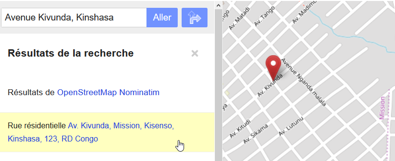

##Le territoire – Un élément essentiel de la cartographie

On illustre sur les cartes les éléments naturels tels que cours d’eau et sommets de montagnes, la couverture du sol, le réseau routier, les systèmes scolaire et de santé, commerces, usines, etc.  La délimitation du territoire est aussi un élément essentiel pour les administrations gouvernementales, les entreprises et les citoyens. L’ajout des limites administratives sur les cartes OSM permet à ces différents acteurs économiques et citoyens de mieux s’informer, planifier, gérer divers projets sur le territoire et jouer un rôle dans la prise de décision.  

Figure 1: Limites administratives, 
Commune de Kisenso et de ses quartiers

Les polygones délimitent le contour de chaque territoire. La hiérarchie du territoire selon le pays, provinces, communes, quartiers, etc. est aussi prise en compte.

Des outils d’analyse cartographique permettent d’extraire les données de la base OSM, les comptabiliser, y repérer certaines caractéristiques, etc. À l’aide des polygones de territoires, ils peuvent subdiviser les données selon ces divers territoires à étudier. Ces polygones sont aussi utilisés par les outils de géolocalisation et de navigation routière pour nous informer de la localisation de différents services, communes, rues, etc.  

Figure 2: Géolocalisation : Avenue Kivunda, Kinshasa

Par exemple, l’outil de géolocalisation de OSM nous permet  de localiser l’Avenue Kivunda à Kinshasa ou encore un commerce ou une adresse sur cette rue. Le résultat de recherche ajoute les informations sur la hiérarchie des territoires dans lesquels se trouve l’élément recherché (ie. province de Kinshasa, commune de Kisenso, quartier Mission).

##Hiérarchisation des limites administratives dans OSM

Les polygones de limites administratives dans OpenStreetMap  décrivent les contours du territoire. Il est aussi possible d’y ajouter des trous correspondant à des zones exclues du territoire. 
Dans OSM, les relation de territoire sont des collections qui regroupent les informations qui définissent les contours internes (ie. zones d’exclusion) et externes du territoire, et les attributs.  

L’ajout de clés OSM spécifiques aux limites administratives permet de hiérarchiser les différentes limites administratives (ie. pays, province, commune, etc.).  La page wiki OSM [boundary=administrative](https://wiki.openstreetmap.org/wiki/Tag:boundary=administrative) décrit cette hiérarchie et répertorie les codes de niveaux administratifs utilisés dans les différents pays. Le tableau 1 présente un exemple de hiérarchie des territoires en RDC.

**Tableau 1 : Hiérarchie des limites administratives dans OSM**

| Territoire  | admin_level |  name |
| :------------- | -----------: | :-------------------------------- |
| Pays  |  2 | République démocratique du Congo  |
| Province |  4 | Kinshasa | 
| Territoire / Ville |  6 | Kinshasa | 
| Collectivité / Commune  |  7 | Kisenso | 
| Quartier  |  8  | Mission | 
| Localité ou Village  |  9  |  | 
| Subdivision, Village  | 10  |  | 

##Obtention des limites de territoires

Les limites de territoire sont définies par les autorités gouvernementales de chaque pays.  Les communautés OSM doivent donc discuter avec ces autorités pour obtenir un fichier vectoriel numérique si disponible et obtenir une licence de publication compatible avec OSM.  Le groupe responsable des aspects juridiques de OSM a établi une procédure pour les imports et il est important de la suivre, sinon les données pourront être effacées de la base OSM par la suite de façon  à ne pas contaminer la base de donnée avec des données dont la licence de publication n’est pas claire. La page wiki  décrit les procédures d’import.  Une page wiki décrivant la licence et les différentes étapes pour l’import doit ête produite. Il faut ensuite communiquer avec le groupe de discussion Import de OSM et y décrire le projet. Il faut habituellement prévoir une période minimum de deux semaines pour permettre aux divers collaborateurs OSM de réagir à ce projet.

La qualité des données disponibles est un autre aspect à considérer. Dans le cadre du projet OpenCities à Kinshasa, les communes ne pouvaient fournir de données numériques précises des limites. À partir de discussions avec les responsables de quartiers des communes de Matete et Kisenso, une esquisse des limites de quartiers a été établie.  En superposant les polygones traçant ces limites avec une carte aérienne, les limites ont été réalignées sur les rues ou cours d’eau à proximité. Les cours d’eau sont des frontières naturelles sur lesquelles sont souvent alignées les limites territoriales.  La délimitation  des limites de quartier sera précisée lors du travail de collecte de données sur le terrain.
